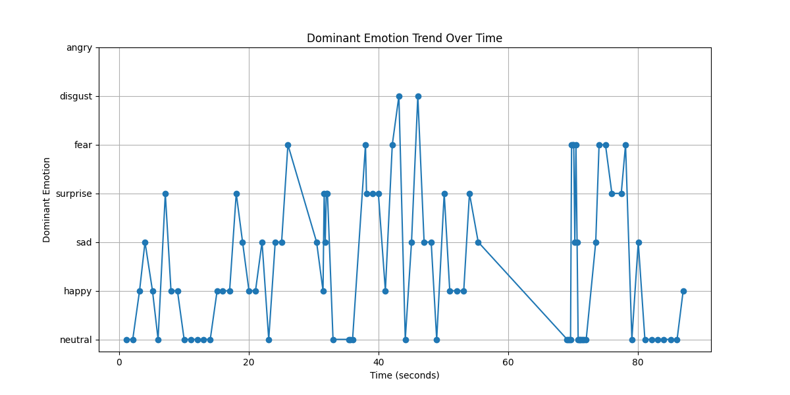

# Emotion Detection System

This project is designed to detect and analyze emotions from video streams in real-time. It utilizes advanced computer vision techniques to identify human faces and classify their emotions into several categories such as `neutral, happy, sad, surprise, fear, disgust, and angry.` The system also plots the trend of dominant emotions over time, providing valuable insights into emotional dynamics.

## Features

- Real-time emotion detection from video streams.
- Identification of multiple emotions.
- Trend analysis of dominant emotions over time.
- Lightweight and efficient, suitable for running on various hardware platforms.

## Example




## Installation

To set up the project environment, follow these steps:

1. Clone the repository to your local machine.
2. Ensure you have Python 3.6 or later installed.
3. Install the required Python libraries by running the following command in your terminal:

```bash
pip install -r requirements.txt
```

## Usage
To start the emotion detection system, run the main script from the terminal.

### Parameters

- --analyze_video: After pressing `q` to stop the video stream, it will save a **png** file with the emotion trend over time.

Ensure your video device is connected and properly configured before starting the application.

## Dependencies
- OpenCV (for video processing and face detection)
- Matplotlib (for plotting emotion trends over time)

**Refer to requirements.txt for a complete list of dependencies.**


## License
This project is licensed under the MIT License - see the LICENSE file for details.
